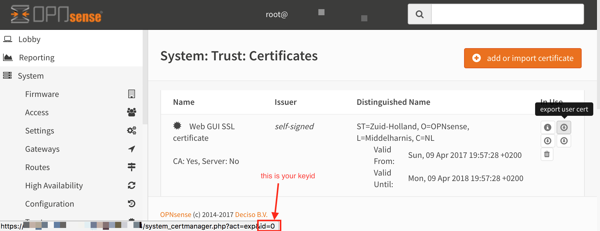

# OPNsense cert/key downloader

This script authenticates against the [OPNsense](https://opnsense.org/) web administration using username and password. It then downloads a cert&key pair from the trust section of the OPNsense UI.

## Example Usage
1. Let your OPNsense firewall do the renewal/storage of [Let's Encrypt](https://letsencrypt.org/) certificates.
2. Use this script to fetch the renewed crt & key from it.
3. Use your crt & key for encrypting your mailserver communication.
4. Profit!

## How to use
```
usage: get-cert.py [-h] --keyfile KEYFILE --certfile CERTFILE --keyid KEYID
                   --url URL --username USERNAME --password PASSWORD

Fetches crt/key-Pair from OPNsense web interface.

optional arguments:
  -h, --help           show this help message and exit
  --keyfile KEYFILE    export .key to
  --certfile CERTFILE  export .crt to
  --keyid KEYID        which key number to export (get this from OPNsense web
                       interface)
  --url URL            url of OPNsense web interface
  --username USERNAME  username for OPNsense web interface
  --password PASSWORD  password for OPNsense web interface
```

To get the keyid, see this picture:

